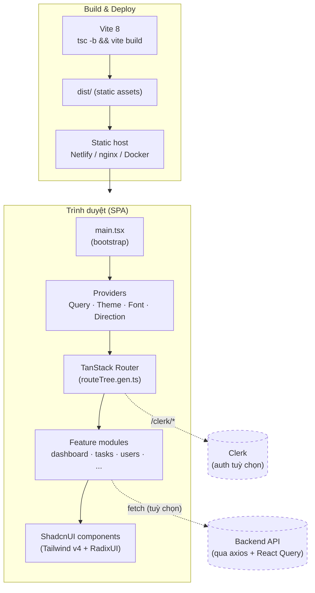

# Tài liệu dự án — Shadcn Admin (shadcnAdminCustom)

Đây là bộ tài liệu kỹ thuật cho **Shadcn Admin Dashboard** — một UI dashboard quản trị
được xây dựng bằng React 19 + Vite + ShadcnUI (TailwindCSS + RadixUI), routing bằng
TanStack Router, data-fetching bằng TanStack Query, state bằng Zustand + React Context.

> Repo này (`shadcnAdminCustom`) là bản tuỳ biến (custom fork) của
> [`vanbienperu3107/shadcn-admin`](https://github.com/vanbienperu3107/shadcn-admin),
> vốn được fork từ dự án gốc [`satnaing/shadcn-admin`](https://github.com/satnaing/shadcn-admin).
> Remote `upstream` vẫn trỏ về repo gốc để có thể `git pull` cập nhật về sau.

## Mục lục

| # | Tài liệu | Nội dung |
|---|----------|----------|
| 1 | [overview.md](overview.md) | Tổng quan dự án, tech stack, tính năng |
| 2 | [architecture.md](architecture.md) | Kiến trúc + **các sơ đồ (diagram)**: provider tree, luồng dữ liệu, layout, error handling |
| 3 | [project-structure.md](project-structure.md) | Bản đồ thư mục `src/` và quy ước |
| 4 | [routing.md](routing.md) | Hệ thống routing file-based + sơ đồ cây route |
| 5 | [state-and-data.md](state-and-data.md) | Quản lý state (Zustand / Context / React Query), cookies, auth |
| 6 | [getting-started.md](getting-started.md) | Cài đặt, biến môi trường, scripts, chạy local |
| 7 | [deployment.md](deployment.md) | Build, CI (GitHub Actions), deploy (Netlify / nginx / Docker) |
| 8 | [server-migration.md](server-migration.md) | **Hướng dẫn di chuyển sang server mới (canonical)** |

## Sơ đồ tổng thể (bird's-eye view)

## Quy ước trong bộ tài liệu

- Ngôn ngữ: tiếng Việt cho phần diễn giải, giữ nguyên thuật ngữ kỹ thuật tiếng Anh
  (`component`, `route`, `provider`, `hook`, ...) cho khớp với code.
- Sơ đồ dùng **Mermaid** — hiển thị trực tiếp trên GitHub và trong VS Code (cài extension
  *Markdown Preview Mermaid Support* nếu cần xem local).
- Đường dẫn file dùng dạng tương đối tính từ gốc repo, ví dụ `src/main.tsx`.
- **Mỗi tài liệu đều có mục _"Di chuyển sang server mới"_** ở cuối, mô tả phần liên quan
  của chủ đề đó khi chuyển sang host/server khác. Bản đầy đủ ở [server-migration.md](server-migration.md).

## Tóm tắt nhanh tech stack

| Hạng mục | Công nghệ |
|----------|-----------|
| Build tool | Vite 8 |
| Ngôn ngữ | TypeScript 6 |
| UI | React 19, ShadcnUI (TailwindCSS v4 + RadixUI) |
| Routing | TanStack Router (file-based, auto code-splitting) |
| Data fetching | TanStack Query (React Query) + axios |
| Bảng dữ liệu | TanStack Table |
| State | Zustand (auth) + React Context (theme/layout/search/feature) |
| Form | React Hook Form + Zod |
| Auth | Clerk (tuỳ chọn) + token store nội bộ (cookie) |
| Charts | Recharts |
| Toast | Sonner |
| Test | Vitest (browser mode, Playwright/Chromium) |
| Lint/Format | ESLint 10, Prettier, Knip |
| Package manager | pnpm |
| Deploy mặc định | Netlify (SPA fallback) |
