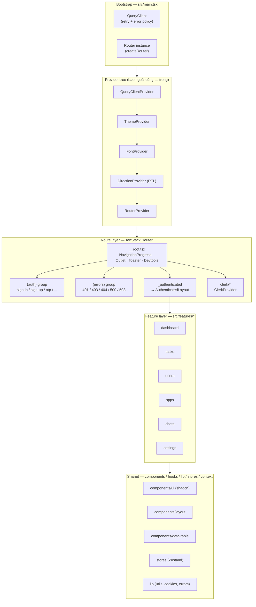
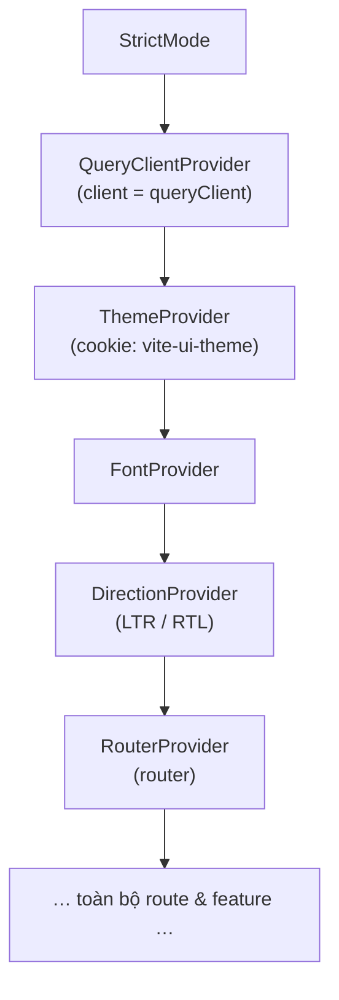
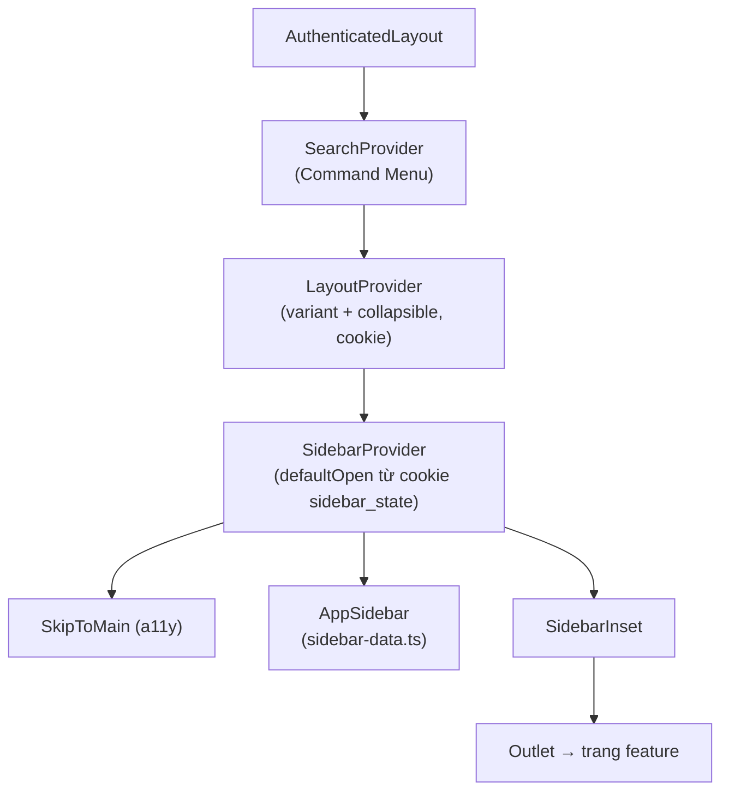
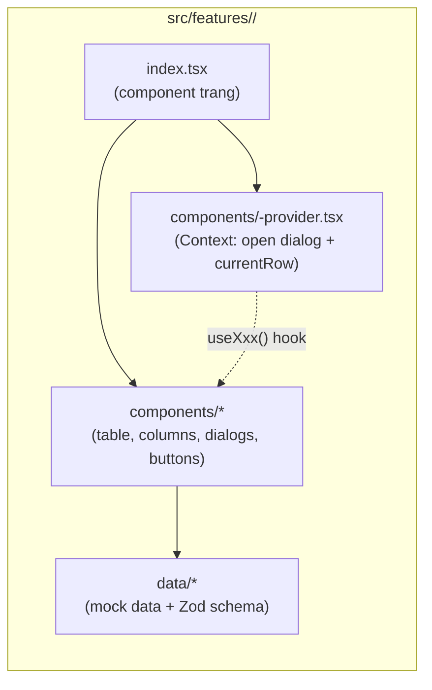
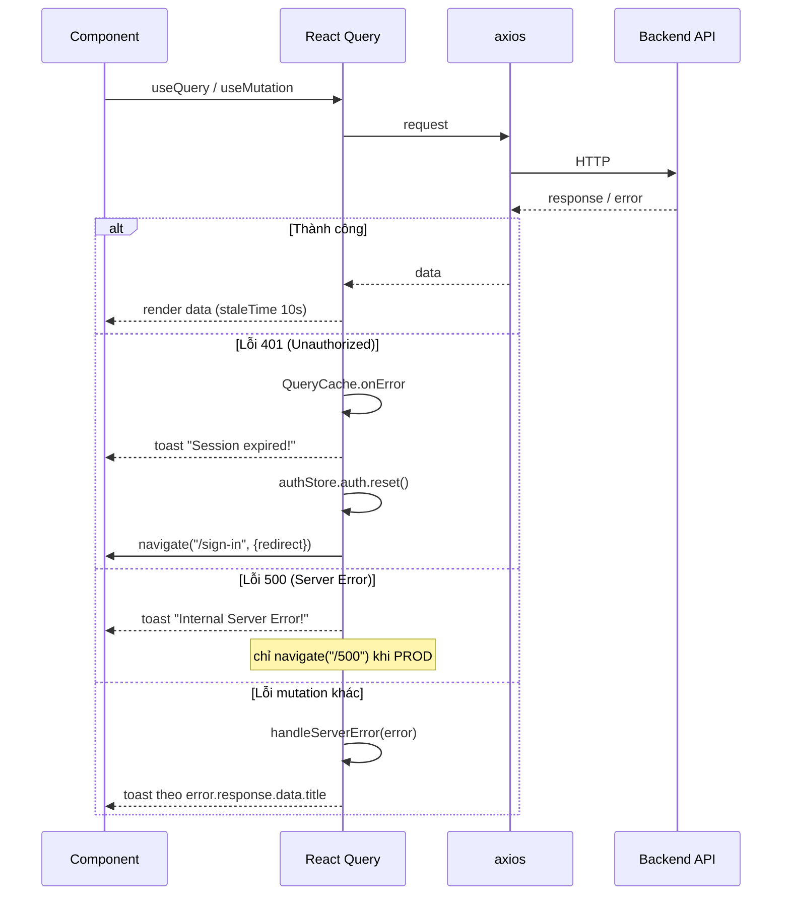
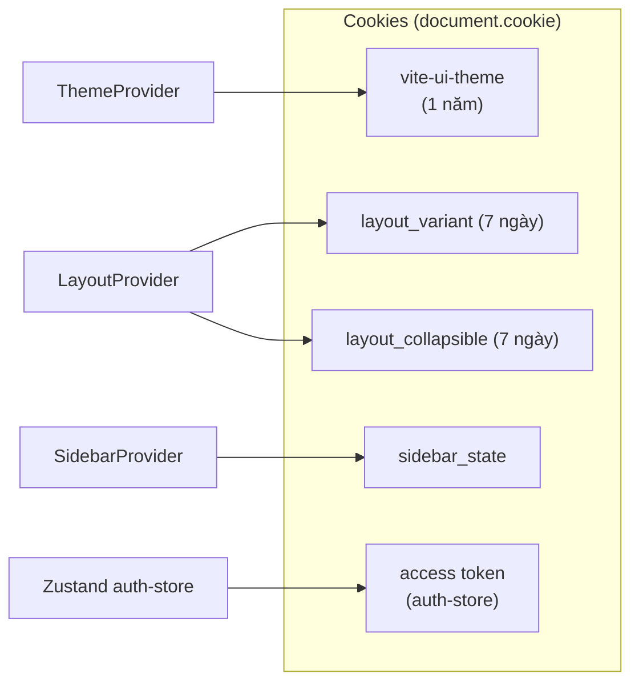
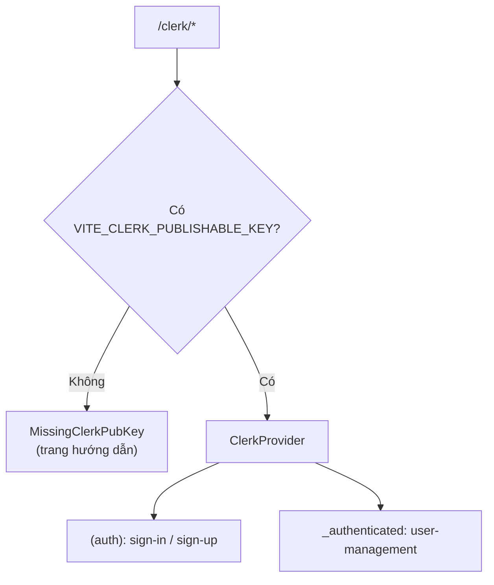

# 2. Kiến trúc & sơ đồ (diagrams)

Tài liệu này mô tả **mô hình kiến trúc** của ứng dụng qua các sơ đồ Mermaid:
provider tree, luồng khởi động, layout, luồng dữ liệu/error, và mô hình feature module.

## 2.1. Kiến trúc tổng thể theo tầng



## 2.2. Provider tree (thứ tự bọc trong `main.tsx`)

Thứ tự rất quan trọng: provider ngoài cùng có hiệu lực rộng nhất.



> Nguồn: [`src/main.tsx`](../src/main.tsx).

## 2.3. Layout của khu vực đã đăng nhập

`AuthenticatedLayout` ([`src/components/layout/authenticated-layout.tsx`](../src/components/layout/authenticated-layout.tsx))
bọc thêm một lớp provider cục bộ cho phần dashboard và dựng khung sidebar:



Bên trong mỗi trang feature thường có: `<Header fixed>` (Search, ThemeSwitch,
ConfigDrawer, ProfileDropdown) + `<Main>` (nội dung) + `<Dialogs>`.

## 2.4. Mô hình một feature module

Tất cả feature trong `src/features/*` theo cùng một khuôn mẫu (ví dụ `tasks`, `users`):



**Khuôn mẫu code** (rút gọn từ `tasks/index.tsx`):

```tsx
<TasksProvider>          {/* Context giữ state dialog + dòng đang chọn */}
  <Header fixed> … </Header>
  <Main>
    <TasksPrimaryButtons />
    <TasksTable data={tasks} />
  </Main>
  <TasksDialogs />       {/* create / update / delete / import */}
</TasksProvider>
```

Provider của feature (vd `tasks-provider.tsx`) dùng `useDialogState` + `useState` để quản
lý trạng thái dialog (`'create' | 'update' | 'delete' | 'import'`) và `currentRow`, expose
qua hook `useTasks()`.

## 2.5. Luồng dữ liệu & xử lý lỗi (React Query)

`QueryClient` trong `main.tsx` cấu hình chính sách retry và **global error handling**:



**Chính sách retry** (rút gọn): DEV không retry (để debug nhanh); PROD retry tối đa 3 lần,
**không** retry với 401/403. `refetchOnWindowFocus` chỉ bật ở PROD. `staleTime = 10s`.

> Nguồn: [`src/main.tsx`](../src/main.tsx), [`src/lib/handle-server-error.ts`](../src/lib/handle-server-error.ts).

## 2.6. Cơ chế lưu trạng thái (persistence)

Ứng dụng không có backend nên phần lớn "sở thích người dùng" được lưu bằng **cookie**
(thông qua tiện ích `src/lib/cookies.ts`, thay cho `js-cookie`).



## 2.7. Tích hợp Clerk (tuỳ chọn, tách rời)

Toàn bộ tích hợp Clerk nằm trong `src/routes/clerk`. `ClerkProvider` chỉ bọc nhánh
`/clerk/*`. Nếu thiếu `VITE_CLERK_PUBLISHABLE_KEY`, route sẽ hiển thị trang hướng dẫn
cấu hình thay vì crash. Có thể xoá thư mục này + gỡ `@clerk/react` mà không ảnh hưởng phần
còn lại.



## 2.8. Di chuyển sang server mới

Về mặt **kiến trúc**, điểm cần lưu ý khi đổi server:

- **Không có tầng server** của riêng app → chỉ cần phục vụ static `dist/`. Mọi "kiến trúc
  backend" thực ra nằm ở **API bên ngoài** mà bạn cấu hình (qua `axios`), không nằm trong repo.
- **Provider/route/feature là client-side** → không phụ thuộc server cụ thể. Chỉ cần host
  phục vụ đúng file và **SPA fallback** để TanStack Router xử lý route ở client.
- **Biến môi trường `VITE_*` được nhúng lúc build** → khi sang server mới mà đổi endpoint
  API/Clerk thì **phải build lại**, không thể sửa runtime.
- **Cookie** (theme/layout/token) gắn theo domain → đổi domain sẽ mất các preference cũ
  (không ảnh hưởng chức năng).

Xem hướng dẫn thao tác chi tiết tại [server-migration.md](server-migration.md).
