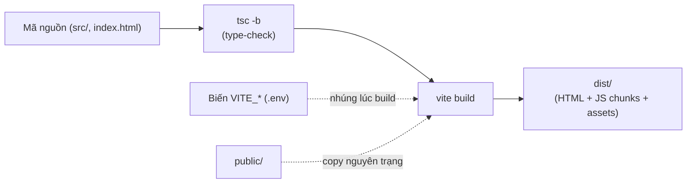
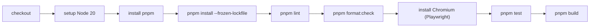

# 7. Build, CI & Triển khai

## 7.1. Quy trình build



`pnpm build` = `tsc -b && vite build`. Kết quả nằm ở **`dist/`** — đây là toàn bộ thứ cần
mang đi deploy. Vì `autoCodeSplitting` bật, JS được tách thành nhiều chunk theo route.

## 7.2. CI — GitHub Actions

File [`.github/workflows/ci.yml`](../.github/workflows/ci.yml) chạy khi **push** hoặc **PR**
vào nhánh `main`:



> Nguyên tắc dự án: **không dùng bản build trên hệ thống thật trước khi CI pass**. Hãy để
> pipeline này xanh trước khi deploy.

(Có thêm `stale.yml` để tự quản lý issue/PR cũ.)

## 7.3. Deploy lên Netlify (mặc định)

Repo đã có [`netlify.toml`](../netlify.toml) cấu hình **SPA fallback**:

```toml
[[redirects]]
  from = "/*"
  to = "/index.html"
  status = 200
```

Cấu hình build trên Netlify:

| Mục | Giá trị |
|-----|---------|
| Build command | `pnpm build` |
| Publish directory | `dist` |
| Environment | `VITE_CLERK_PUBLISHABLE_KEY` (nếu dùng Clerk) |

## 7.4. Tự host bằng nginx

Build rồi copy `dist/` lên server, ví dụ `/var/www/shadcn-admin`:

```nginx
server {
    listen 80;
    server_name your-domain.example;
    root /var/www/shadcn-admin;
    index index.html;

    # SPA fallback — bắt buộc để route sâu không bị 404 khi F5
    location / {
        try_files $uri $uri/ /index.html;
    }

    # Cache asset có hash trong tên (an toàn cache lâu)
    location /assets/ {
        expires 1y;
        add_header Cache-Control "public, immutable";
    }
}
```

> Đừng cache `index.html` lâu (nó tham chiếu tên chunk có hash; cache lâu sẽ trỏ chunk cũ).

## 7.5. Tự host bằng Docker

`Dockerfile` (multi-stage: build bằng Node, serve bằng nginx):

```dockerfile
# --- build stage ---
FROM node:20-alpine AS build
WORKDIR /app
RUN corepack enable
COPY package.json pnpm-lock.yaml ./
RUN pnpm install --frozen-lockfile
COPY . .
# truyền key lúc build nếu dùng Clerk:
ARG VITE_CLERK_PUBLISHABLE_KEY
ENV VITE_CLERK_PUBLISHABLE_KEY=$VITE_CLERK_PUBLISHABLE_KEY
RUN pnpm build

# --- serve stage ---
FROM nginx:alpine
COPY --from=build /app/dist /usr/share/nginx/html
COPY nginx.conf /etc/nginx/conf.d/default.conf
EXPOSE 80
```

`nginx.conf` dùng cấu hình SPA fallback như §7.4. Build & chạy:

```bash
docker build --build-arg VITE_CLERK_PUBLISHABLE_KEY=pk_xxx -t shadcn-admin .
docker run -p 8080:80 shadcn-admin
```

## 7.6. Deploy dưới sub-path

Nếu phục vụ tại `https://host/admin/` (không phải root), đặt `base` trong `vite.config.ts`:

```ts
export default defineConfig({ base: '/admin/', /* ... */ })
```

rồi build lại. Thiếu bước này, asset và route sẽ trỏ sai đường dẫn.

## 7.7. Di chuyển sang server mới

Tóm tắt deploy khi đổi server (chi tiết ở [server-migration.md](server-migration.md)):

1. Bảo đảm CI xanh trên `main`.
2. Build artifact `dist/` (build local, hoặc trong CI, hoặc Docker multi-stage).
3. Copy `dist/` lên server mới; cấu hình web server + **SPA fallback** (mục §7.4/§7.5).
4. Trỏ DNS/domain mới; bật HTTPS (Let's Encrypt/Caddy/nginx + certbot).
5. Cập nhật **redirect/allowed origins của Clerk** cho domain mới (nếu dùng).
6. Cập nhật URL trong thẻ meta `index.html` (og:url, twitter:url) cho đúng domain mới.
7. Smoke test: F5 ở một route sâu (vd `/settings/account`) để chắc SPA fallback hoạt động.
