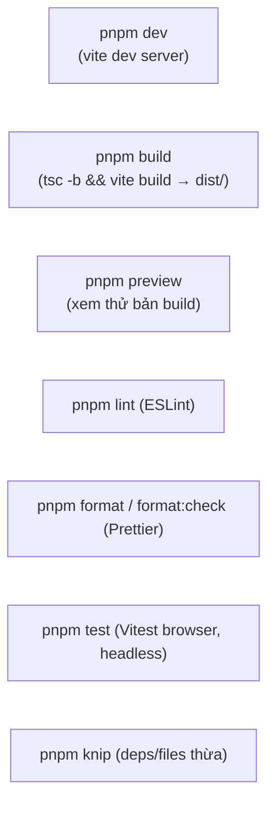

# 6. Bắt đầu (Getting Started)

## 6.1. Yêu cầu môi trường

| Công cụ | Phiên bản khuyến nghị | Ghi chú |
|---------|----------------------|---------|
| Node.js | **20+** | CI dùng Node 20 |
| pnpm | mới nhất | package manager chính (có `pnpm-lock.yaml`) |
| Git | bất kỳ | |

> Trên Windows, lưu ý ghi chú repo: ổ FAT32 (vd `D:`) có thể gây lỗi git khi
> checkout/rm và VS Code khoá file — nên đặt repo trên ổ NTFS nếu gặp trục trặc.

## 6.2. Cài đặt

```bash
# 1) Cài dependencies (đúng theo lockfile)
pnpm install

# 2) Tạo file .env từ mẫu
cp .env.example .env      # Windows PowerShell: Copy-Item .env.example .env
```

## 6.3. Biến môi trường

| Biến | Bắt buộc? | Mô tả |
|------|-----------|-------|
| `VITE_CLERK_PUBLISHABLE_KEY` | Không | Publishable key của Clerk. **Bỏ trống** nếu không dùng Clerk — nhánh `/clerk/*` sẽ hiển thị trang hướng dẫn thay vì lỗi. |

> Mọi biến `VITE_*` được **nhúng vào bundle lúc build** (Vite). Đổi giá trị ⇒ **phải build lại**.
> Không đặt secret nhạy cảm phía server vào đây vì nó sẽ lộ trong bundle phía client.

## 6.4. Các script (package.json)



| Script | Lệnh | Dùng khi |
|--------|------|----------|
| `dev` | `vite` | Phát triển local (HMR) |
| `build` | `tsc -b && vite build` | Tạo bản production trong `dist/` |
| `preview` | `vite preview` | Chạy thử bản build trên local |
| `lint` | `eslint .` | Kiểm tra lint |
| `format` | `prettier --write .` | Tự format |
| `format:check` | `prettier --check .` | Kiểm tra format (CI dùng) |
| `test` | `vitest run --browser.headless` | Chạy test browser-mode headless |
| `test:watch` | `vitest --browser.headless` | Test watch |
| `test:ui` | `vitest --ui --browser.headless` | UI runner |
| `test:coverage` | `vitest run --coverage ...` | Báo cáo coverage |
| `test:browser:install` | `playwright install chromium --with-deps` | Cài Chromium cho test (chạy 1 lần) |
| `knip` | `knip` | Tìm file/dependency không dùng |

## 6.5. Chạy local

```bash
pnpm dev
# Mặc định mở tại http://localhost:5173
```

Devtools của React Query và TanStack Router **tự bật ở môi trường development** (nút ở góc
màn hình) — xem `__root.tsx`.

## 6.6. Test

Test chạy ở **browser mode** thật (Vitest + Playwright/Chromium), không phải jsdom:

```bash
pnpm test:browser:install   # lần đầu: cài Chromium
pnpm test                   # chạy toàn bộ test (headless)
```

File test đặt cạnh file nguồn (`*.test.ts(x)`). Theo ghi chú dự án: **ưu tiên sửa bug bằng
test case CI tái lập được**, và **không dùng bản build trên hệ thống thật trước khi CI pass**.

## 6.7. Thêm component ShadcnUI

```bash
pnpm dlx shadcn@latest add <component>
```

Lưu ý: một số component đã được **tuỳ biến cho RTL** (alert-dialog, calendar, command, dialog,
dropdown-menu, select, table, sheet, sidebar, switch) và một số **modified** (scroll-area,
sonner, separator). Khi update qua CLI cần **merge tay** để không mất các tuỳ biến này
(xem `README.md` gốc, mục Customized Components).

## 6.8. Di chuyển sang server mới

Liên quan tới **khởi tạo môi trường** trên server/máy mới:

1. Cài **Node 20+** và **pnpm** trên máy đích (hoặc dùng CI build artifact).
2. Lấy mã nguồn: `git clone <repo>` hoặc copy. Repo này có sẵn remote:
   - `origin` → `vanbienperu3107/shadcnAdminCustom`
   - `upstream` → `vanbienperu3107/shadcn-admin` (để `git pull` cập nhật bản gốc)
3. Tạo lại `.env` trên máy mới (không có trong git) với `VITE_CLERK_PUBLISHABLE_KEY` nếu cần.
4. `pnpm install --frozen-lockfile && pnpm build` → lấy `dist/`.
5. Phục vụ `dist/` qua web server tĩnh + **SPA fallback**.

Toàn bộ quy trình build → host → cấu hình server: xem [deployment.md](deployment.md) và
[server-migration.md](server-migration.md).
