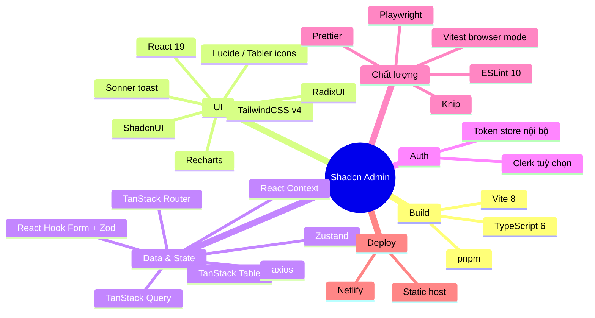

# 1. Tổng quan dự án

## 1.1. Shadcn Admin là gì?

**Shadcn Admin Dashboard** là một UI dashboard quản trị (admin) được dựng sẵn, tập trung
vào **responsive**, **accessibility** và khả năng **tái sử dụng**. Đây là một
**Single Page Application (SPA)** thuần front-end: toàn bộ logic chạy trên trình duyệt,
build ra static assets (HTML/CSS/JS) và phục vụ qua bất kỳ static host nào.

Phiên bản hiện tại: **v2.2.1** (xem `package.json`).

Dự án **không phải** một backend — dữ liệu hiện tại là *mock data* nằm trong các thư mục
`data/` của từng feature. Việc tích hợp API thật sẽ đi qua `axios` + TanStack Query
(hạ tầng đã được cấu hình sẵn trong `src/main.tsx`).

## 1.2. Tính năng chính

- 🌗 **Light / Dark / System theme** (lưu bằng cookie, mặc định theo hệ thống).
- 📱 **Responsive** trên mọi kích thước màn hình.
- ♿ **Accessible** (skip-to-main, focus management, RadixUI primitives).
- 📂 **Sidebar** dựng sẵn, có nhiều biến thể (`inset` / `sidebar` / `floating`) và chế độ
  thu gọn (`icon` / `offcanvas` / `none`) — lưu trạng thái bằng cookie.
- 🔍 **Global search** (Command Menu — `Ctrl/Cmd + K`).
- 🌐 **RTL support** (hỗ trợ ngôn ngữ phải-sang-trái — một số component đã được tuỳ biến).
- 🧩 **10+ trang**: Dashboard, Tasks, Apps, Chats, Users, Settings, Auth, Errors, Help Center.
- 🔐 **Clerk auth** (tích hợp tuỳ chọn, tách biệt hoàn toàn trong `src/routes/clerk`).

## 1.3. Tech stack

| Hạng mục | Công nghệ | Ghi chú |
|----------|-----------|---------|
| Build tool | **Vite 8** | dev server + bundler |
| Ngôn ngữ | **TypeScript 6** | strict, có type-check `tsc -b` khi build |
| UI framework | **React 19** | dùng cú pháp Context mới (`<Context value=...>`) |
| Design system | **ShadcnUI** | TailwindCSS v4 + RadixUI; component nằm trong `src/components/ui` |
| Routing | **TanStack Router** | file-based, `autoCodeSplitting`, sinh `routeTree.gen.ts` |
| Data fetching | **TanStack Query** | QueryClient cấu hình retry + global error handling |
| Bảng | **TanStack Table** | wrapper tái sử dụng trong `src/components/data-table` |
| State toàn cục | **Zustand** | `src/stores/auth-store.ts` (token lưu cookie) |
| State theo phạm vi | **React Context** | theme, font, direction, layout, search, và per-feature |
| Form | **React Hook Form + Zod** | validate bằng `@hookform/resolvers` |
| Icons | **Lucide** + **Tabler** | Tabler chỉ dùng brand icons |
| Charts | **Recharts** | dùng ở Dashboard |
| Toast | **Sonner** | `Toaster` đặt ở root route |
| Auth | **Clerk** | tuỳ chọn, bật bằng `VITE_CLERK_PUBLISHABLE_KEY` |
| Test | **Vitest** (browser mode) | chạy thật trên Chromium qua Playwright |
| Lint / Format | **ESLint 10**, **Prettier** | + **Knip** phát hiện code/deps thừa |
| Package manager | **pnpm** | CI dùng `--frozen-lockfile` |

## 1.4. Đối tượng & cách dùng repo này

- Đây là bản **custom** (`shadcnAdminCustom`) để tuỳ biến cho nhu cầu riêng.
- Nhánh chính: `main`. Mọi push/PR vào `main` đều chạy CI (lint → prettier → test → build).
- Khi cần cập nhật từ dự án gốc: `git fetch upstream && git merge upstream/main`.

## 1.5. Di chuyển sang server mới

Vì đây là **SPA tĩnh**, "di chuyển sang server mới" thực chất là **đem thư mục build
`dist/` sang host khác** và cấu hình SPA fallback. Không có database hay state phía server
cần migrate.

Checklist tối thiểu khi đổi server:

1. Cài Node 20+ và pnpm trên máy build (hoặc build sẵn rồi copy `dist/`).
2. Sao chép file `.env` (chứa `VITE_CLERK_PUBLISHABLE_KEY` nếu dùng Clerk) — biến môi
   trường được nhúng vào bundle **lúc build**, nên phải build lại nếu đổi giá trị.
3. Chạy `pnpm install --frozen-lockfile && pnpm build` để ra `dist/`.
4. Copy `dist/` lên server mới, trỏ web server (nginx/Apache/Caddy) vào đó, **bật SPA
   fallback** (mọi route → `index.html`).
5. Cập nhật domain trong các thẻ meta (`index.html`) và URL callback của Clerk (nếu dùng).

Chi tiết đầy đủ (nginx config, Docker, Netlify, tự host trên VPS Ubuntu) xem
[server-migration.md](server-migration.md).
