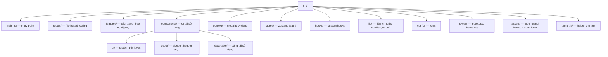

# 3. Cấu trúc thư mục & quy ước

## 3.1. Cây thư mục cấp cao

```
shadcn-admin/
├── .github/              # CI/CD, issue & PR templates
│   └── workflows/ci.yml  # lint → prettier → test → build
├── docs/                 # 📚 tài liệu này
├── public/               # static assets (images, favicon, avatars)
├── src/                  # mã nguồn
├── .env.example          # mẫu biến môi trường (VITE_CLERK_PUBLISHABLE_KEY)
├── components.json       # cấu hình ShadcnUI CLI
├── eslint.config.js      # ESLint 10 flat config
├── knip.config.ts        # phát hiện file/deps không dùng
├── netlify.toml          # SPA redirect cho Netlify
├── package.json          # scripts & dependencies
├── tsconfig*.json        # cấu hình TypeScript (app / node / base)
└── vite.config.ts        # Vite + plugins + cấu hình test (Vitest)
```

## 3.2. Bản đồ `src/`



## 3.3. Giải thích từng thư mục

| Thư mục | Vai trò | File tiêu biểu |
|---------|---------|----------------|
| `src/routes/` | Định nghĩa route (file-based). TanStack Router sinh `routeTree.gen.ts` tự động. | `__root.tsx`, `_authenticated/route.tsx`, `(auth)/sign-in.tsx` |
| `src/features/` | Mỗi feature = một "trang"/màn hình nghiệp vụ, gói gọn UI + state + mock data. | `tasks/index.tsx`, `users/`, `dashboard/` |
| `src/components/ui/` | Component shadcn (Tailwind + Radix). Một số đã tuỳ biến cho RTL. | `button.tsx`, `dialog.tsx`, `sidebar.tsx`, `table.tsx` |
| `src/components/layout/` | Khung layout: sidebar, header, nav-group, nav-user, team-switcher, top-nav. | `app-sidebar.tsx`, `data/sidebar-data.ts` |
| `src/components/data-table/` | Các mảnh bảng tái sử dụng (toolbar, pagination, column-header, faceted-filter, bulk-actions). | `index.ts` |
| `src/context/` | Provider toàn cục: theme, font, direction (RTL), layout, search. | `theme-provider.tsx`, `layout-provider.tsx` |
| `src/stores/` | State toàn cục với Zustand. | `auth-store.ts` |
| `src/hooks/` | Hook dùng chung. | `use-dialog-state.tsx`, `use-mobile.tsx`, `use-table-url-state.ts` |
| `src/lib/` | Tiện ích thuần. | `utils.ts` (`cn`), `cookies.ts`, `handle-server-error.ts` |
| `src/config/` | Cấu hình tĩnh. | `fonts.ts` |
| `src/styles/` | CSS toàn cục + theme tokens. | `index.css`, `theme.css` |
| `src/assets/` | Icon/logo dạng component React. | `logo.tsx`, `brand-icons/`, `custom/` |
| `src/test-utils/` | Helper cho test (cookies, tanstack-table). | `cookies.ts` |

## 3.4. Quy ước đặt tên & tổ chức

- **kebab-case** cho tên file (`tasks-provider.tsx`, `use-table-url-state.ts`).
- File **test** đặt cạnh file nguồn với hậu tố `.test.ts(x)` (vd `cookies.test.ts`).
- **Feature module** luôn có: `index.tsx` (trang) + `components/` + (tuỳ) `data/` + provider.
- Alias import **`@/`** → `src/` (cấu hình ở `vite.config.ts` và `tsconfig`).
- File **`routeTree.gen.ts`** là **sinh tự động** — không sửa tay; được loại khỏi coverage/lint trọng tâm.
- Component trong `src/components/ui` được loại khỏi coverage (xem `vite.config.ts`).

## 3.5. Các file cấu hình gốc đáng chú ý

| File | Mục đích |
|------|----------|
| `vite.config.ts` | Plugins (`tanstackRouter` autoCodeSplitting, `react`, `tailwindcss`), alias `@`, cấu hình Vitest (browser mode + Playwright). |
| `components.json` | Cấu hình ShadcnUI CLI (đường dẫn, style, alias). |
| `eslint.config.js` | ESLint 10 flat config + plugin react-hooks/react-refresh/query. |
| `knip.config.ts` | Phát hiện file & dependency không dùng. |
| `netlify.toml` | Redirect `/* → /index.html` (SPA fallback). |
| `tsconfig.json` / `*.app.json` / `*.node.json` | Cấu hình TypeScript phân tách app vs node. |

## 3.6. Di chuyển sang server mới

Liên quan tới **cấu trúc thư mục** khi đổi server:

- Chỉ có **`dist/`** (kết quả `pnpm build`) là thứ cần đẩy lên server tĩnh — không cần
  copy `src/`, `node_modules/`, hay file cấu hình dev.
- Nếu host build trực tiếp trên server (CI hoặc trên VPS): cần `package.json`,
  `pnpm-lock.yaml`, `vite.config.ts`, `tsconfig*.json`, `index.html`, `src/`, `public/`,
  và `.env`. **Không** commit `.env` (đã nằm trong `.gitignore`) — copy thủ công/đặt qua secret.
- `netlify.toml` chỉ có tác dụng trên Netlify; sang nginx/Apache/Caddy cần cấu hình SPA
  fallback tương đương (xem [server-migration.md](server-migration.md)).
- `public/` được copy nguyên trạng vào `dist/` khi build — đảm bảo favicon/avatars/images
  đi kèm khi chuyển host.
