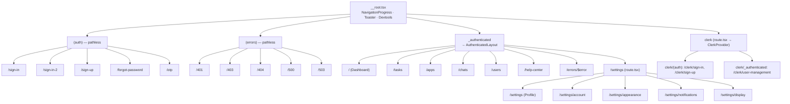
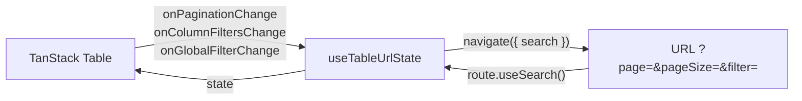

# 4. Hệ thống Routing (TanStack Router)

Dự án dùng **TanStack Router** ở chế độ **file-based routing**. Plugin
`@tanstack/router-plugin/vite` quét thư mục `src/routes/` và **sinh tự động** file
`src/routeTree.gen.ts` (đã bật `autoCodeSplitting`). **Không sửa tay** file gen này.

## 4.1. Quy ước đặt tên route

| Ký hiệu | Ý nghĩa | Ví dụ |
|---------|---------|-------|
| `__root.tsx` | Route gốc, bọc toàn bộ app. | `routes/__root.tsx` |
| `(tên)` | **Pathless group** — gom nhóm file nhưng **không** thêm segment vào URL. | `(auth)`, `(errors)` |
| `_tên` | **Layout route** — bọc layout cho route con, **không** thêm segment vào URL. | `_authenticated` |
| `route.tsx` | Định nghĩa layout/route cha cho thư mục đó. | `_authenticated/route.tsx` |
| `index.tsx` | Route mặc định của thư mục (path "/"). | `_authenticated/index.tsx` |
| `$param` | Route động (dynamic segment). | `errors/$error.tsx` |

## 4.2. Cây route

## 4.3. Root route

[`src/routes/__root.tsx`](../src/routes/__root.tsx) tạo root bằng
`createRootRouteWithContext<{ queryClient }>()`. Nó render:

- `<NavigationProgress />` — thanh tiến trình khi chuyển trang.
- `<Outlet />` — nơi render route con.
- `<Toaster duration={5000} />` — toast (Sonner) toàn cục.
- Devtools (React Query + Router) **chỉ ở môi trường development**.
- `notFoundComponent` → `NotFoundError`; `errorComponent` → `GeneralError`.

Context `{ queryClient }` được truyền vào router từ `main.tsx`, cho phép loader/route truy
cập React Query client.

## 4.4. Nhóm route

### `(auth)` — trang xác thực (UI mẫu)
Sign In, Sign In (2 cột), Sign Up, Forgot Password, OTP. Đây là **giao diện mẫu** dùng
React Hook Form + Zod; logic auth thật tuỳ bạn nối vào (hoặc dùng Clerk).

### `(errors)` — trang lỗi
`401`, `403`, `404`, `500`, `503` map tới các component trong `src/features/errors/`.
`main.tsx` tự điều hướng tới `/500` khi gặp lỗi server (chỉ ở PROD) và tới `/sign-in` khi 401.

### `_authenticated` — khu vực dashboard
Layout route gắn `AuthenticatedLayout` (sidebar + header). Mọi trang chính (Dashboard,
Tasks, Apps, Chats, Users, Settings, Help Center) nằm dưới đây. Lưu ý: bản gốc **chưa cài
guard chặn truy cập** — nếu cần bảo vệ thật, thêm `beforeLoad` kiểm tra token trong
`_authenticated/route.tsx` rồi `redirect` về `/sign-in`.

### `clerk/*` — tích hợp Clerk tách rời
`clerk/route.tsx` bọc `ClerkProvider`; nếu thiếu publishable key sẽ hiển thị trang hướng dẫn.
Xem [architecture.md §2.7](architecture.md#27-tích-hợp-clerk-tuỳ-chọn-tách-rời).

## 4.5. Đồng bộ state ↔ URL (table state)

Hook [`use-table-url-state.ts`](../src/hooks/use-table-url-state.ts) đồng bộ
**pagination / global filter / column filters** của TanStack Table vào **search params** của
URL (qua `navigate({ search })`). Nhờ vậy trạng thái bảng có thể **bookmark / share / reload**
mà vẫn giữ nguyên. Giá trị mặc định (page 1, pageSize 10) được lược bỏ khỏi URL cho gọn.

## 4.6. Code splitting & preload

- `autoCodeSplitting: true` → mỗi route được tách thành chunk riêng, tải khi cần.
- Router cấu hình `defaultPreload: 'intent'` (xem `main.tsx`) → preload khi người dùng
  **hover/định hướng** tới link, giúp chuyển trang mượt.

## 4.7. Di chuyển sang server mới

Routing là **client-side**, nên điểm mấu chốt khi đổi server là **SPA fallback**:

- Mọi URL sâu (vd `/settings/account`, `/users?page=2`) khi **refresh trực tiếp** phải được
  server trả về `index.html` để router xử lý ở client. Thiếu cấu hình này → **404 khi F5**.
  - Netlify: đã có `netlify.toml` (`/* → /index.html`).
  - nginx: `try_files $uri $uri/ /index.html;`
  - Apache: `FallbackResource /index.html` hoặc rewrite rule.
  - Caddy: `try_files {path} /index.html`.
- Nếu deploy dưới **sub-path** (vd `https://host/admin/`) thì phải set `base` trong
  `vite.config.ts` (`base: '/admin/'`) và build lại, nếu không asset/route sẽ lệch đường dẫn.
- URL callback của Clerk (`signInUrl`, `afterSignOutUrl`, ...) trong `src/routes/clerk/route.tsx`
  là **đường dẫn nội bộ** nên không đổi theo domain; chỉ cần cập nhật **allowed origins/redirect
  URLs trong Clerk Dashboard** cho domain mới.

Chi tiết cấu hình từng web server: [server-migration.md](server-migration.md).
