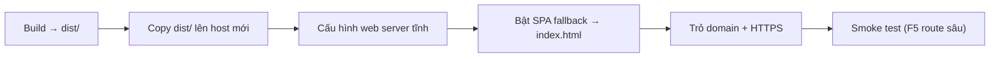

# 8. Di chuyển sang server mới (Server Migration) — Hướng dẫn canonical

Đây là tài liệu **đầy đủ** về việc đưa ứng dụng sang một server/host mới. Các file docs khác
chỉ tóm tắt phần liên quan tới chủ đề của chúng và trỏ về đây.

## 8.1. Bản chất: đây là SPA tĩnh

Shadcn Admin là **Single Page Application thuần client**. "Di chuyển server" **không** liên
quan tới database, session phía server hay state nội bộ — mà chỉ là:



Ba điều **luôn phải nhớ**:

1. **Biến `VITE_*` được nhúng lúc build** → đổi API/Clerk endpoint thì **build lại**, không
   sửa runtime.
2. **SPA fallback bắt buộc** → mọi route phải fallback về `index.html`, nếu không F5 ở route
   sâu sẽ 404.
3. **Cookie gắn theo domain** → đổi domain làm mất theme/layout/token đã lưu (chỉ là reset
   preference, không hỏng app).

## 8.2. Checklist tổng quát

- [ ] Đảm bảo CI trên `main` đang **xanh** (lint + format + test + build).
- [ ] Có Node 20+ & pnpm trên máy build (hoặc dùng CI/Docker).
- [ ] Có file `.env` đúng cho môi trường đích (`VITE_CLERK_PUBLISHABLE_KEY` nếu dùng Clerk).
- [ ] `pnpm install --frozen-lockfile && pnpm build` → ra `dist/`.
- [ ] Copy `dist/` lên server mới.
- [ ] Cấu hình web server + **SPA fallback**.
- [ ] Trỏ DNS + bật HTTPS.
- [ ] Cập nhật allowed origins / redirect URLs của Clerk cho domain mới (nếu dùng).
- [ ] Cập nhật `og:url` / `twitter:url` trong `index.html` cho domain mới.
- [ ] Smoke test: mở `/`, F5 ở `/settings/account`, kiểm tra theme/dark-mode, kiểm tra
      Command Menu (Ctrl/Cmd+K).

## 8.3. Phương án A — Netlify (đổi site/team)

1. Tạo site mới, kết nối repo `shadcnAdminCustom`.
2. Build command `pnpm build`, publish dir `dist`.
3. Khai báo env `VITE_CLERK_PUBLISHABLE_KEY` (nếu dùng).
4. `netlify.toml` đã lo SPA fallback — không cần thêm.

## 8.4. Phương án B — Tự host trên VPS Ubuntu + nginx (khuyến nghị cho self-host)

Phù hợp khi bạn đã có VPS Ubuntu riêng. Có **2 mô hình**: build tại chỗ, hoặc build nơi khác
rồi chỉ copy `dist/`.

### B.1. Chuẩn bị server

```bash
# Trên VPS Ubuntu mới
sudo apt update && sudo apt install -y nginx
sudo mkdir -p /var/www/shadcn-admin
sudo chown -R "$USER":"$USER" /var/www/shadcn-admin
```

### B.2. Build artifact

**Cách 1 — build trên máy dev rồi copy:**

```bash
pnpm install --frozen-lockfile
pnpm build
# copy dist/ lên server
rsync -avz --delete dist/ user@SERVER_IP:/var/www/shadcn-admin/
# hoặc: scp -r dist/* user@SERVER_IP:/var/www/shadcn-admin/
```

**Cách 2 — build ngay trên VPS** (cần Node 20 + pnpm trên VPS):

```bash
# cài Node 20 (qua nvm hoặc nodesource) và pnpm
git clone https://github.com/vanbienperu3107/shadcnAdminCustom.git
cd shadcnAdminCustom
printf 'VITE_CLERK_PUBLISHABLE_KEY=pk_xxx\n' > .env   # nếu dùng Clerk; nếu không, bỏ qua
pnpm install --frozen-lockfile
pnpm build
sudo rsync -avz --delete dist/ /var/www/shadcn-admin/
```

### B.3. Cấu hình nginx

`/etc/nginx/sites-available/shadcn-admin`:

```nginx
server {
    listen 80;
    server_name your-domain.example;     # đổi domain
    root /var/www/shadcn-admin;
    index index.html;

    location / {
        try_files $uri $uri/ /index.html;   # SPA fallback
    }

    location /assets/ {
        expires 1y;
        add_header Cache-Control "public, immutable";
    }

    # tránh cache index.html để luôn lấy chunk mới nhất
    location = /index.html {
        add_header Cache-Control "no-cache";
    }
}
```

```bash
sudo ln -s /etc/nginx/sites-available/shadcn-admin /etc/nginx/sites-enabled/
sudo nginx -t && sudo systemctl reload nginx
```

### B.4. HTTPS (Let's Encrypt)

```bash
sudo apt install -y certbot python3-certbot-nginx
sudo certbot --nginx -d your-domain.example
```

> Khi bật HTTPS, nếu auth thật dùng cookie do backend set, đảm bảo cookie có `Secure` +
> `SameSite` phù hợp để không mất phiên khi gọi API.

## 8.5. Phương án C — Docker (portable nhất)

Dùng `Dockerfile` + `nginx.conf` mô tả trong [deployment.md §7.5](deployment.md#75-tự-host-bằng-docker).
Ưu điểm: artifact bất biến, di chuyển giữa các server chỉ là `docker pull && docker run`.

```bash
docker build --build-arg VITE_CLERK_PUBLISHABLE_KEY=pk_xxx -t shadcn-admin .
docker run -d --restart unless-stopped -p 80:80 --name shadcn-admin shadcn-admin
```

## 8.6. Những thứ KHÔNG cần migrate

- **Database** — không có.
- **Session/state phía server** — không có (state ở client: cookie + memory).
- **Mock data** — nằm trong bundle, đi cùng `dist/`.
- **`node_modules/`** — cài lại bằng `pnpm install`, đừng copy qua mạng.

## 8.7. Những thứ DỄ QUÊN khi đổi server

| Hạng mục | Hành động |
|----------|-----------|
| SPA fallback | Cấu hình `try_files … /index.html` (nginx) hoặc tương đương — **nguyên nhân #1 gây 404 khi F5**. |
| Biến `VITE_*` | Đặt lại trên môi trường build và **build lại** (không sửa được runtime). |
| Clerk | Thêm domain mới vào **Allowed Origins / Redirect URLs** trong Clerk Dashboard. |
| Meta tags | Sửa `og:url`, `twitter:url`, `og:image` trong `index.html` cho domain mới. |
| Sub-path | Nếu không deploy ở root, set `base` trong `vite.config.ts` rồi build lại. |
| Cache | Cache lâu cho `/assets/*` (có hash), **no-cache** cho `index.html`. |
| HTTPS/cookie | Bật `Secure`/`SameSite` đúng khi chạy HTTPS + gọi API. |

## 8.8. Quy trình rollback nhanh

Vì artifact là tĩnh, rollback đơn giản: giữ lại `dist/` (hoặc image Docker) của bản trước,
trỏ web server về thư mục/đời cũ rồi `reload`. Khuyến nghị deploy theo thư mục có version
(vd `/var/www/shadcn-admin/releases/<git-sha>/`) + symlink `current` để bật/tắt nhanh.

```bash
# ví dụ pattern release + symlink
RELEASE=/var/www/shadcn-admin/releases/$(git rev-parse --short HEAD)
sudo rsync -avz dist/ "$RELEASE"/
sudo ln -sfn "$RELEASE" /var/www/shadcn-admin/current
sudo systemctl reload nginx
```

## 8.9. Smoke test sau khi migrate

1. Mở trang chủ `/` → Dashboard hiển thị.
2. F5 trực tiếp tại `/settings/account` và `/users?page=2` → **không** 404 (SPA fallback OK).
3. Đổi theme dark/light → reload vẫn giữ (cookie OK).
4. Mở Command Menu (Ctrl/Cmd+K) → search hoạt động.
5. Nếu dùng Clerk: vào `/clerk/sign-in` → không hiện trang "Missing Publishable Key".
