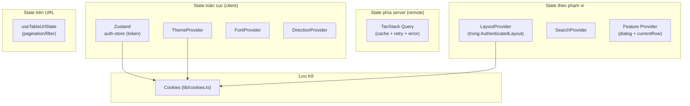

# 5. Quản lý State & Dữ liệu

Ứng dụng dùng nhiều cơ chế state cho các mục đích khác nhau. Nguyên tắc: **chọn đúng công
cụ cho đúng phạm vi**.



## 5.1. TanStack Query — remote state

Cấu hình tập trung trong [`src/main.tsx`](../src/main.tsx):

- **`queries.retry`**: DEV không retry (debug nhanh); PROD retry ≤ 3 lần; **không** retry với
  HTTP 401/403.
- **`refetchOnWindowFocus`**: chỉ bật ở PROD.
- **`staleTime`**: 10 giây.
- **`mutations.onError`** → `handleServerError(error)` (toast theo `error.response.data.title`),
  riêng 304 → toast "Content not modified!".
- **`QueryCache.onError`** (global): 401 → toast "Session expired!" + `authStore.reset()` +
  điều hướng `/sign-in?redirect=...`; 500 → toast + (PROD) navigate `/500`.

> Hiện tại các feature dùng **mock data** trong `data/`. Khi nối API thật, tạo
> `useQuery`/`useMutation` với `axios`; mọi lỗi sẽ tự đi qua cơ chế global ở trên.

## 5.2. Zustand — auth store

[`src/stores/auth-store.ts`](../src/stores/auth-store.ts) giữ thông tin xác thực:

```ts
interface AuthUser { accountNo: string; email: string; role: string[]; exp: number }

auth: {
  user, setUser,
  accessToken, setAccessToken,   // ghi cookie khi set
  resetAccessToken,              // xoá cookie
  reset,                         // xoá user + token
}
```

- Token được **đọc từ cookie lúc khởi tạo store** và **ghi cookie mỗi khi `setAccessToken`**.
- Tên cookie token hiện là chuỗi placeholder `'thisisjustarandomstring'`.

> ⚠️ **Bảo mật**: lưu access token trong cookie không `HttpOnly` (JS đọc được) phù hợp cho
> demo. Khi đưa lên production thật, cân nhắc cookie `HttpOnly`/`Secure` do backend set, hoặc
> luồng auth của Clerk.

## 5.3. React Context — providers

| Provider | File | Lưu ở | Vai trò |
|----------|------|-------|---------|
| `ThemeProvider` | `context/theme-provider.tsx` | cookie `vite-ui-theme` (1 năm) | light/dark/system; theo dõi `prefers-color-scheme` |
| `FontProvider` | `context/font-provider.tsx` | cookie | chọn font chữ |
| `DirectionProvider` | `context/direction-provider.tsx` | — | LTR/RTL cho toàn app |
| `LayoutProvider` | `context/layout-provider.tsx` | cookie `layout_variant`, `layout_collapsible` (7 ngày) | biến thể & chế độ thu gọn sidebar |
| `SearchProvider` | `context/search-provider.tsx` | — | điều khiển Command Menu (Ctrl/Cmd+K) |

Mỗi provider expose một hook (`useTheme`, `useLayout`, ...) ném lỗi nếu dùng ngoài provider —
giúp bắt lỗi sớm.

## 5.4. Feature Context — dialog state

Mỗi feature có provider riêng (vd `tasks-provider.tsx`, `users-provider.tsx`) dùng
`useDialogState` + `useState` để quản lý:

- `open`: loại dialog đang mở (`'create' | 'update' | 'delete' | 'import'` …).
- `currentRow`: bản ghi đang thao tác.

Expose qua hook `useTasks()` / `useUsers()`. Đây là state **cục bộ theo feature**, không
cần đẩy lên toàn cục.

## 5.5. URL state — bảng dữ liệu

`useTableUrlState` (xem [routing.md §4.5](routing.md#45-đồng-bộ-state--url-table-state))
đồng bộ pagination/filter vào URL search params → bookmark/share/reload giữ nguyên trạng thái.

## 5.6. Form state — React Hook Form + Zod

- Form (auth, settings, tasks/users dialogs) dùng **React Hook Form**.
- Schema validate bằng **Zod** + `@hookform/resolvers/zod`.
- Mock data của feature cũng định nghĩa schema Zod trong `data/schema.ts` để type-safe.

## 5.7. Persistence (cookies)

Tiện ích `src/lib/cookies.ts` (`getCookie`/`setCookie`/`removeCookie`) thao tác trực tiếp
`document.cookie` (thay cho `js-cookie`). Mọi preference (theme, layout, sidebar) và token
đều lưu qua đây. Cookie an toàn khi `document` không tồn tại (SSR-safe guard).

## 5.8. Di chuyển sang server mới

Liên quan tới **state & dữ liệu** khi đổi server:

- **Cookie gắn theo domain**: đổi domain → người dùng mất theme/layout/token đã lưu (sẽ về
  mặc định). Không ảnh hưởng chức năng; chỉ là reset preference.
- **Token & phiên đăng nhập**: nếu auth thật do backend cấp, đảm bảo backend mới set cookie
  đúng domain/`SameSite`/`Secure`. Với Clerk, cập nhật **allowed origins** trong Clerk Dashboard.
- **Endpoint API** (base URL của axios) thường đến từ biến `VITE_*` → **build lại** khi đổi
  server/API; không sửa được lúc runtime.
- **Mock data** nằm trong bundle (không phải DB) → không cần migrate gì khi đổi host.
- Nếu chuyển sang dùng HTTPS ở server mới, đặt cookie `Secure` và kiểm tra `SameSite` để
  tránh mất phiên khi gọi API cross-site.

Hướng dẫn thao tác đầy đủ: [server-migration.md](server-migration.md).
